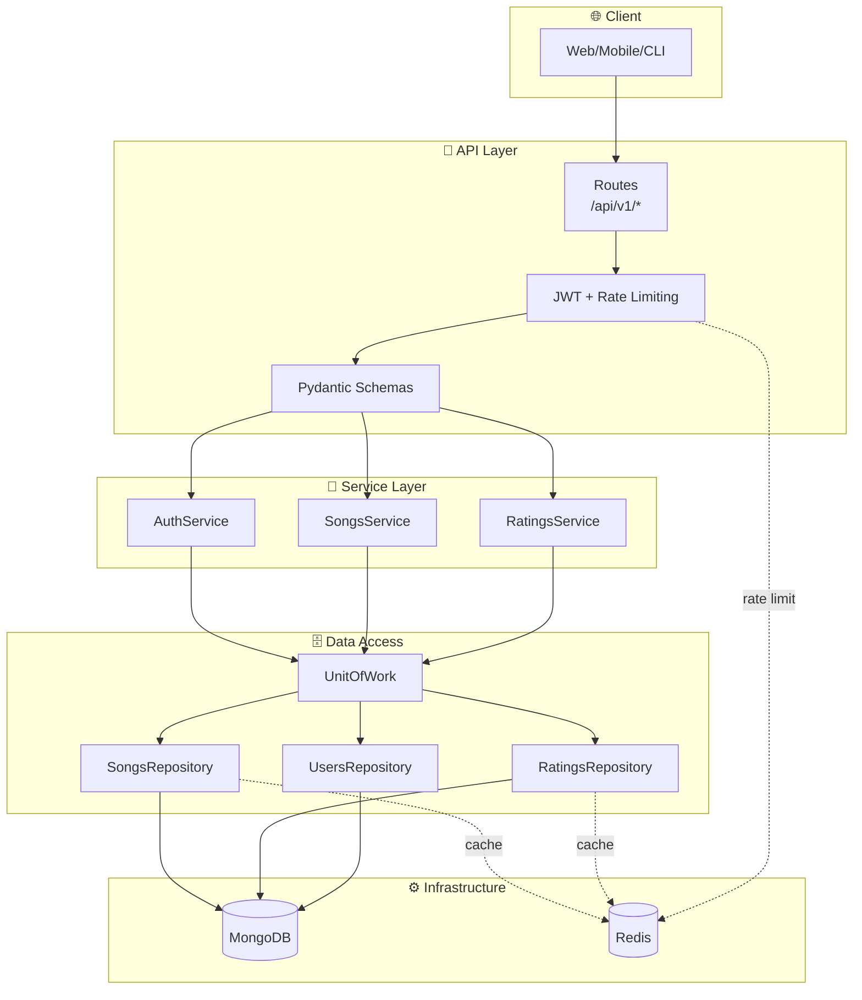
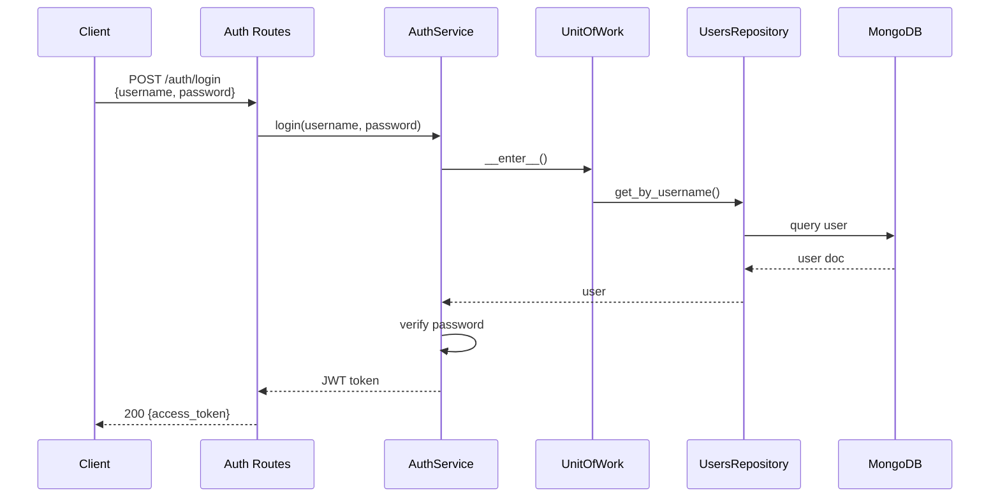
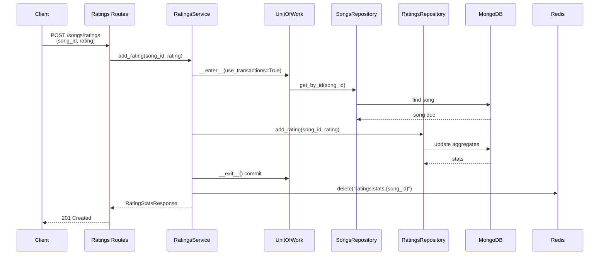
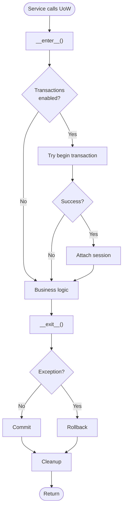
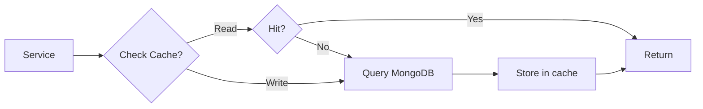

# Architecture Schema

Production-ready REST API with layered architecture: **Routes → Services → UoW → Repositories → MongoDB**

---

## System Architecture



---

## Authentication Flow



---

## Add Rating Flow (with Cache Invalidation)



---

## Unit of Work Pattern



---

## Repository Cache Pattern



---

## Project Structure

```
songs_project/
├── songs_api/
│   ├── __init__.py              # Flask app factory
│   ├── settings.py              # Pydantic settings
│   ├── schemas.py               # Request/response models
│   ├── api/v1/                  # Routes (auth, songs, system)
│   ├── services/                # Business logic
│   ├── repositories/            # Data access
│   ├── infrastructure/          # UoW, cache, rate limiter, DB
│   ├── models/documents.py      # MongoEngine models
│   ├── security/jwt_auth.py     # JWT authentication
│   └── scripts/                 # Seed scripts
├── tests/                       # Test suite
├── wsgi.py                      # Gunicorn entry
├── docker-compose.yml           # MongoDB + Redis + API
└── env.sample                   # Environment template
```

---

## Design Patterns

- **Unit of Work**: Transaction management via context manager
- **Repository**: Data access abstraction with cache integration
- **Service Layer**: Business logic orchestration
- **Dependency Injection**: SystemResources container
- **Cache-Aside**: Check cache → miss → query DB → store cache

---

## Tech Stack

| Component | Technology |
|-----------|-----------|
| Web Framework | Flask 3.x |
| Database | MongoDB + MongoEngine |
| Cache | Redis |
| Auth | JWT + bcrypt |
| Validation | Pydantic 2.x |
| Server | Gunicorn |
| Testing | pytest + mongomock |
